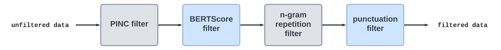

# BanglaParaphrase

This repository contains the code, data, and associated models of the paper titled [**"BanglaParaphrase: A High-Quality Bangla Paraphrase Dataset"**](https://arxiv.org/abs/2210.05109), accepted in *Proceedings of the Asia-Pacific Chapter of the Association for Computational Linguistics: AACL 2022*.

## Table of Contents

- [BanglaParaphrase](#banglaParaphrase)
  - [Table of Contents](#table-of-contents)
  - [Datasets](#datasets)
  - [Filtering Pipeline](#filtering-pipeline)
  - [Training & Evaluation](#training--evaluation)
  - [Models](#models)
  - [License](#license)
  - [Citation](#citation)
  
## Datasets
  
***Disclaimer: You must agree to the [license](#license) and terms of use before using the dataset.***

The dataset files are organized in `.jsonl` format  i.e. one JSON per line. **Download the dataset from [here](https://huggingface.co/datasets/csebuetnlp/BanglaParaphrase/tree/main).**

One example from the `test` part of the dataset is given below in JSON format. 
```
{
  "source": "খোঁজ খবর রাখতেন বিজ্ঞানের অগ্রগতি নিয়ে।", 
  "target": "বিজ্ঞানের অগ্রগতির দিকে তিনি নজর রেখেছিলেন।"
}
  ```

### Data Splits
Dataset  with  train-dev-test  example  counts  are  given  below:
Language       | ISO  639-1  Code | Train | Validation | Test |
-------------- | ---------------- | ------- | ----- | ------ |
Bengali | bn | 419, 967 | 233, 31 | 233, 32 |

## Filtering Pipeline
The following filtering pipeline was used to preprocess the raw dataset to ensure high quality.


| Filter Name | Significance | Filtering Parameters |
| ----------- | ----------- |----------------------------|
| PINC | Ensure diversity in generated paraphrase | 0.65, 0.76, 0.80|
| BERTScore   | Preserve semantic coherence with the source |lower 0.91 - 0.93, upper 0.98|
|N-gram repetition|Reduce n-gram repetition during inference|2 - 4 grams|
| Punctuation | Prevent generating non-terminating sentences during inference | N/A |

In the respective folders, instructions on how to run certain filtering and scoring scripts are provided.

### Run the full pipeline
Install requirements from [requirements](https://github.com/csebuetnlp/banglaparaphrase/blob/master/requirements.txt) and then run the following command.
```
bash filter.sh -i <input> -p <pinc_threshold> -l <lower_bert_score_threshold> -h <higher_bert_score_threshold>
```
Where `input` is the path to the jsonl file containing sentences and their corresponding paraphrases as key value pairs, `pinc_threshold` is the threshold for PINCScore, `lower_bert_score_threshold` and `higher_bert_score_threshold` are the limits for BERTScore in scale of 0 to 1.

This will generate two files named `source.bn` and `target.bn` in the working directory containing the filtered pairs after passing through all the filtering steps.

## Training & Evaluation
For training and evaluation, please refer to the repository of [BanglaNLG](https://github.com/csebuetnlp/BanglaNLG).
  
## Models

The model checkpoint from the paper is available at [huggingface model hub](https://huggingface.co/csebuetnlp/banglat5_banglaparaphrase).


## License
Contents of this repository are restricted to only non-commercial research purposes under the [Creative Commons Attribution-NonCommercial-ShareAlike 4.0 International License (CC BY-NC-SA 4.0)](https://creativecommons.org/licenses/by-nc-sa/4.0/). Copyright of the dataset contents belongs to the original copyright holders.


## Citation
```
@article{akil2022banglaparaphrase,
  title={BanglaParaphrase: A High-Quality Bangla Paraphrase Dataset},
  author={Akil, Ajwad and Sultana, Najrin and Bhattacharjee, Abhik and Shahriyar, Rifat},
  journal={arXiv preprint arXiv:2210.05109},
  year={2022}
}
```
